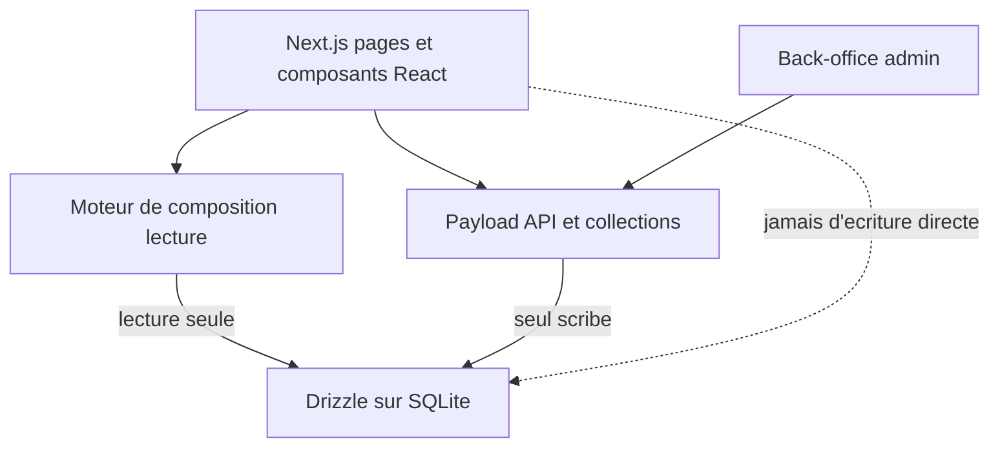
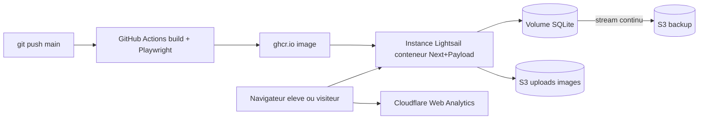
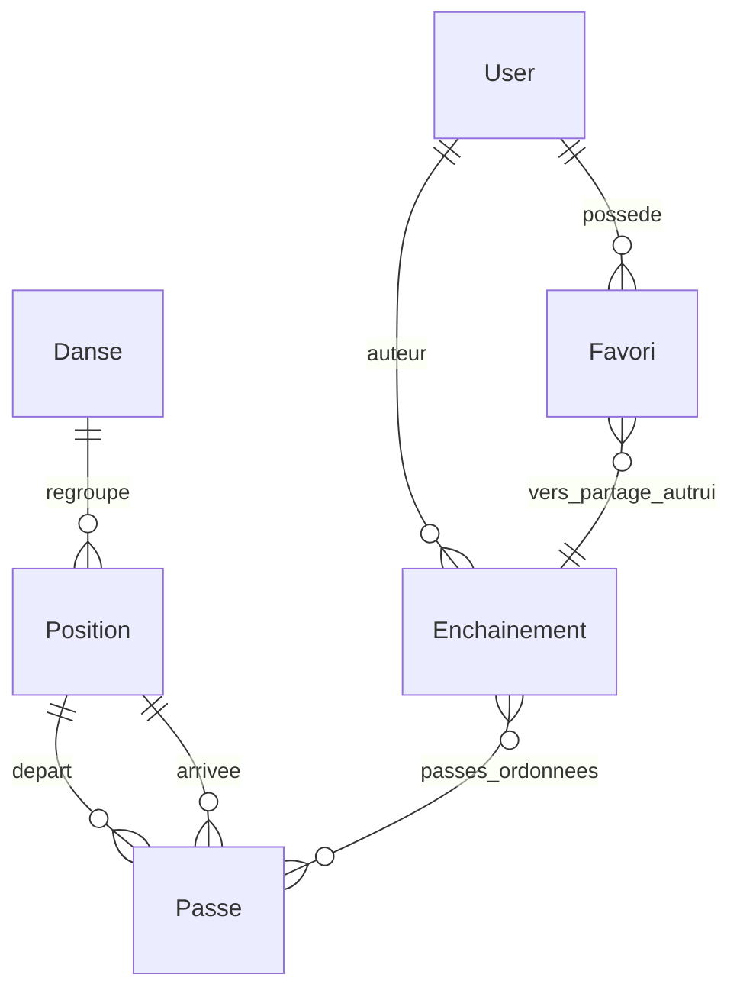

# Architecture Spine — passe-finder-v2

## Design Paradigm

**Monolithe modulaire full-stack.** Une seule base de code TypeScript, un seul artefact déployable. Le framework applicatif (Payload CMS) est monté *dans* l'application web (Next.js) : mêmes processus, même conteneur, pas de frontière réseau interne, pas de second service.

Le paradigme est un choix de **maintenabilité solo** (contre-métrique CM-1 du PRD, cause d'abandon des versions précédentes) préféré à un découpage en services serverless.

| Couche | Rôle | Où |
| --- | --- | --- |
| **Payload (data + admin + auth + accès)** | Définit les collections, génère le back-office `/admin`, l'auth, les contrôles d'accès et les API ; seul scribe de la base | `src/collections/`, `src/payload.config.ts` |
| **Next.js (rendu + routes)** | Pages SSR pour le lecture-lourd (catalogue, fiches, enchaînement partagé) + composants React interactifs (compositeur) | `src/app/` |
| **Moteur de composition** | Lecture du graphe (« passes depuis la position courante ») côté serveur | `src/engine/` |
| **Base relationnelle** | SQLite (libSQL) via l'adaptateur Drizzle de Payload | fichier sur volume persistant |

## Invariants & Rules

Direction de dépendance autorisée (qui peut dépendre de qui) :



### AD-1 — Payload est le seul scribe de la base `[ADOPTED]`
- **Binds:** toutes les écritures de données (FR-1, FR-3, FR-14, FR-15, FR-25, FR-26)
- **Prevents:** deux propriétaires d'une même donnée, validations/contrôles d'accès contournés par une écriture SQL brute
- **Rule:** toute mutation passe par l'API/les hooks/les contrôles d'accès de Payload. Les lectures peuvent utiliser Drizzle directement (ex. moteur de composition), **mais via le schéma Drizzle typé généré par Payload** (jamais du SQL brut sur des noms de tables supposés) — ainsi tout changement de collection casse à la compilation, pas silencieusement. **Aucune écriture Drizzle ne contourne Payload.**

### AD-2 — Le graphe vit sur la Passe ; la composition est une lecture serveur
- **Binds:** FR-9, FR-10, FR-11 (moteur d'enchaînement)
- **Prevents:** une logique de graphe dupliquée/divergente côté client, des enchaînements incohérents
- **Rule:** les arêtes sont `Passe.positionDébut` / `Passe.positionFin`. « Passes possibles depuis la position courante » = lecture serveur `WHERE positionDébut = courante`. Le client ne reconstruit jamais le graphe lui-même.

### AD-3 — Propriété & permissions concentrées dans les contrôles d'accès Payload
- **Binds:** FR-7, FR-15, FR-26, FR-29
- **Prevents:** des règles de permission éparpillées et incohérentes selon l'écran
- **Rule:** l'admin (drapeau `admin`) possède Danse/Position/Passe ; l'auteur possède son Enchaînement (lui seul l'édite/supprime). Toutes ces règles vivent dans les `access` des collections Payload — **un seul endroit**, jamais réimplémentées dans l'UI.

### AD-4 — Visibilité : partagé = public, privé = auteur
- **Binds:** FR-17, FR-18, FR-21, FR-24, FR-38
- **Prevents:** la fuite d'un enchaînement privé via une fiche publique ou un reverse-lookup
- **Rule:** `visibilité = partagé` → lisible **sans connexion** ; `privé` → auteur seul. **Défaut à la création = `privé`** (on ne partage jamais par accident). Les surfaces dérivées (fiche passe → enchaînements/vidéos qui l'utilisent, favoris) ne remontent **que** du partagé.

### AD-5 — Même-danse ; la danse de la passe est dérivée
- **Binds:** FR-5, FR-6
- **Prevents:** une passe reliant deux danses différentes ; une donnée `danse` redondante et désynchronisée
- **Rule:** `Position` porte la danse. Une passe exige `positionDébut.danse == positionFin.danse` (hook de validation) ; la danse de la passe **se déduit** de ses positions (non stockée sur la passe).

### AD-6 — Suppression bloquée si référencé
- **Binds:** FR-8
- **Prevents:** casser l'enchaînement de révision d'un élève en supprimant une passe/position utilisée
- **Rule:** supprimer une Position ou une Passe encore référencée (par une Passe ou un Enchaînement) est **refusé** (hook Payload) ; l'admin retire d'abord les références.

### AD-7 — Favori seulement sur un enchaînement partagé d'autrui
- **Binds:** FR-22, FR-25, FR-27, FR-30
- **Prevents:** mettre en favori ses propres enchaînements, ou du contenu privé
- **Rule:** un `Favori` ne se crée que si `enchaînement.auteur != user` **et** `enchaînement.visibilité == partagé`. **Unicité : au plus un Favori par couple (user, enchaînement).** Le profil expose deux listes disjointes : « mes enchaînements » (auteur) et « mes favoris » (Favori).

### AD-8 — Champs legacy archivés, jamais exposés en v1
- **Binds:** FR-31, FR-32
- **Prevents:** faire réapparaître dans l'UI des données hors-scope (personnalisation, vidéo sur passe)
- **Rule:** `youtube_url` legacy (de la passe), `customName`, `PersonnalizePasse` sont conservés en base mais **non lus par l'API/l'admin/l'UI** en v1.

### AD-9 — Authentification via Payload intégré `[ADOPTED]`
- **Binds:** FR-24, FR-25, FR-26 (résout la question ouverte Q-1 du PRD)
- **Prevents:** un service d'auth externe supplémentaire à opérer (Cognito) ou une auth maison à sécuriser
- **Rule:** comptes/sessions/réinitialisation reposent sur la collection `users` d'auth de Payload (email + mot de passe). Pas de fournisseur d'auth externe.

### AD-10 — SQLite sur volume persistant, sauvegarde continue vers S3 `[ADOPTED]`
- **Binds:** NFR-4 (fiabilité de sauvegarde), NFR-6 (coût)
- **Prevents:** la perte d'un enchaînement ; la dépendance à un service de base coûteux
- **Rule:** la base est un fichier SQLite (libSQL) sur le disque persistant de l'instance. Un mécanisme de **streaming continu vers S3** (Litestream / réplication libSQL) garantit qu'aucune écriture validée n'est perdue si l'instance disparaît.

### AD-11 — Uploads dans S3, découplés de l'instance `[ADOPTED]`
- **Binds:** FR-1, FR-2, NFR-3
- **Prevents:** la perte des images au remplacement de l'instance ; un couplage image↔serveur
- **Rule:** les images de positions sont stockées dans S3 via l'adaptateur de stockage Payload. Une position sans image utilise le placeholder `no_position` (la création n'est jamais bloquée par l'image).

### AD-12 — Instance Lightsail unique, pipeline commit → prod `[ADOPTED]`
- **Binds:** FR-40, FR-41, NFR-5, NFR-6
- **Prevents:** un déploiement manuel ; un empilement de services ; la dérive du coût
- **Rule:** l'app tourne dans **un conteneur Docker sur une instance Lightsail** (VM à prix fixe, disque persistant pour SQLite). Pipeline : push `main` → GitHub Actions build l'image → `ghcr.io` → l'instance pull + redémarre. Aucun geste technique manuel.

### AD-13 — Playwright en filet avant déploiement ; pas de staging v1
- **Binds:** NFR-2, contre-métrique CM-2
- **Prevents:** une régression du geste central mise en prod sans détection
- **Rule:** les tests E2E Playwright s'exécutent en local et **dans la CI avant le déploiement**. Pas d'environnement de staging séparé en v1 (simplicité assumée).

### AD-14 — Migration via l'API Local de Payload, ordonnée et vérifiable
- **Binds:** FR-28, FR-29, FR-30, FR-31, FR-32, FR-33, M-3
- **Prevents:** une migration qui contourne les invariants (accès, validation) ou corrompt l'ordre de dépendance
- **Rule:** un script one-off lit `passe-finder-saveDB.gz` et peuple via l'**API Local de Payload** (donc AD-1 tient) dans l'ordre Danses → Positions → Passes → Enchaînements. Tous les enchaînements → Alain ; images manquantes → `no_position` ; champs legacy archivés (AD-8). **Vérifiable** (comptage source vs cible) et **rejouable** sans doublon.

### AD-15 — Instrumentation via Cloudflare Web Analytics `[ADOPTED]`
- **Binds:** FR-43, M-2
- **Prevents:** un tableau de bord de stats à construire/maintenir in-app ; une bannière cookies inutile
- **Rule:** mesure d'audience par Cloudflare Web Analytics (script léger, sans cookie, console externe). La distinction connectés vs anonymes se dérive **côté app** (état de session), pas via l'outil de stats. Aucun écran de stats in-app en v1.

## Consistency Conventions

| Concern | Convention |
| --- | --- |
| Nommage entités | Collections Payload : `Danse`, `Position`, `Passe`, `Enchainement`, `User`, `Favori` (singulier, PascalCase). Position et Passe portent un `nom`. |
| Langue | Domaine et UI en **français** (NFR-7). Identifiants de code en anglais technique standard. |
| Écriture des données | Toujours via l'API/les hooks Payload (AD-1). Lectures custom via Drizzle autorisées, en lecture seule. |
| Contrôles d'accès | Uniquement dans les `access` des collections Payload (AD-3, AD-4) ; jamais dupliqués dans l'UI. |
| Dérivation | La danse d'une Passe/d'un Enchaînement se déduit des positions/passes ; ne pas la stocker en double (AD-5). |
| Sélecteur de danse | Masqué dans l'UI/admin v1 (défaut « rock 6 temps ») ; le champ existe sur Position pour l'extension future. |
| Placeholder image | `no_position` pour toute position sans image (AD-11). |
| Ordre des passes | L'ordre des passes d'un Enchaînement est porté par un champ tableau ordonné Payload (l'index = l'ordre) ; ne pas dériver l'ordre d'ailleurs. |

## Stack

Versions vérifiées courantes au 2026-07-21 ; le code en devient propriétaire une fois créé.

| Name | Version |
| --- | --- |
| TypeScript | 5.x |
| Node.js | 22 LTS |
| Next.js | ≥ 16.2.2 (minimum requis par Payload ≥ 3.73) |
| React | 19.2 |
| Payload CMS | ≥ 3.73 (correctif injection SQL `@payloadcms/drizzle`) |
| Adaptateur base | `@payloadcms/db-sqlite` (Drizzle + libSQL) |
| Sauvegarde | Litestream (ou réplication libSQL) → S3 |
| Conteneur / registre | Docker · GitHub Container Registry (ghcr.io) |
| CI/CD | GitHub Actions |
| Hébergement | AWS Lightsail (instance) · AWS S3 (uploads + backup) |
| Tests E2E | Playwright |
| Analytics | Cloudflare Web Analytics |

## Structural Seed

Topologie de déploiement :



Modèle de données (entités + relations) :



Arborescence source (scaffold, le code possède le détail) :

```text
passe-finder/  (branche v2)
  src/
    app/            # routes et pages Next.js (public + compositeur)
    collections/    # collections Payload (Danse, Position, Passe, Enchainement, User, Favori)
    engine/         # lectures du graphe (composition) via Drizzle
    payload.config.ts
  migrate/          # script one-off de migration depuis passe-finder-saveDB.gz
  tests/e2e/        # Playwright
  Dockerfile
  .github/workflows/ # build + tests + deploy
```

## Capability → Architecture Map

| Capacité (PRD) | Vit dans | Gouverné par |
| --- | --- | --- |
| F1 Catalogue (Positions/Passes/Danse) | `collections/` + admin `/admin` | AD-1, AD-3, AD-5, AD-6, AD-11 |
| F2 Moteur d'enchaînement | `engine/` + `app/` (compositeur) | AD-2, AD-1 |
| F3 Consultation & partage (fiches, favoris) | `app/` (pages SSR) + `collections/Favori` | AD-4, AD-7 |
| F4 Comptes & rôles | `collections/User` (auth Payload) | AD-9, AD-3 |
| F5 Migration legacy | `migrate/` | AD-14, AD-8 |
| F6 Lien vidéo | `collections/Enchainement` + fiches passe | AD-4, AD-8 |
| Déploiement & CI/CD | `Dockerfile`, `.github/workflows/` | AD-12, AD-13 |
| Instrumentation | script Cloudflare dans `app/` | AD-15 |
| Persistance & sauvegarde | volume + side-car backup | AD-10 |

## Deferred

- **Scaling horizontal** — SQLite couple la base à une instance unique. Suffisant à l'échelle v1 (Alain + ~50 élèves) ; à rouvrir si le trafic ou le multi-écoles (Vision) l'exigent.
- **Auth externe / fédérée** (Google, etc.) — écartée en v1 (AD-9) ; rouvrable si des écoles tierces rejoignent.
- **Multi-danses en contenu** — la dimension existe dans le modèle mais l'UI est mono-danse v1 ; l'activation (sélecteur, filtres) est différée.
- **Lecteur vidéo intégré / timestamp** — hors v1 (PRD F6/Vision) ; seule l'URL sur l'enchaînement est portée.
- **Staging séparé & observabilité avancée** — non nécessaires à cette échelle ; Playwright + logs de l'instance suffisent en v1.
- **Nom de domaine** (registrar, coût) — décision opérationnelle d'Alain, hors architecture (PRD Q-4).
